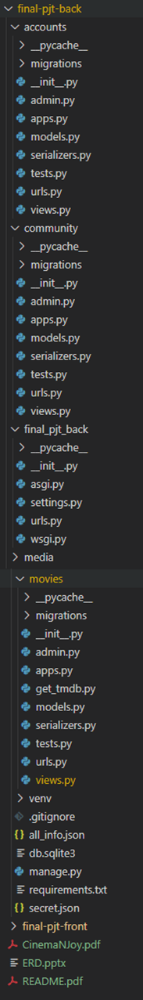
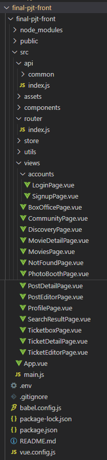
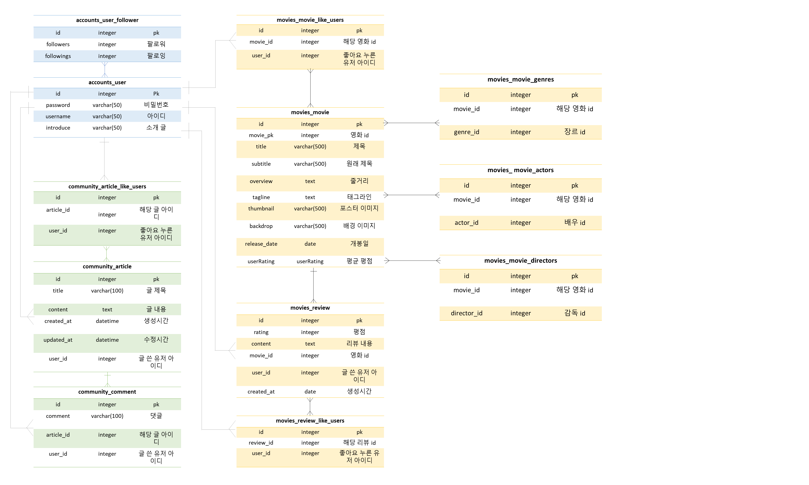
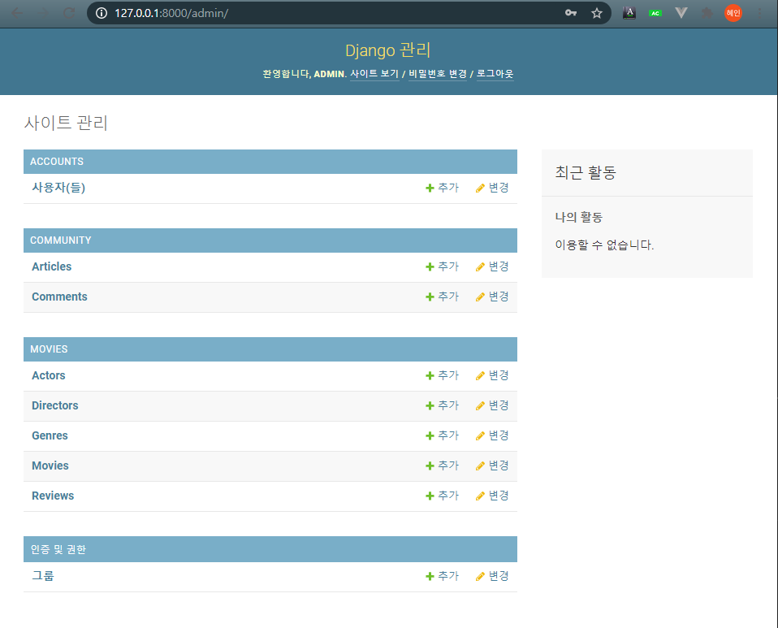

# MovieNJoy

> 프론트 담당: 이다영
>
> 백엔드 담당: 조혜인

## 1. 목표

- 영화 정보 기반 추천 서비스 구성
- 커뮤니티 서비스 구성
- HTML, CSS, JavaScript, Vue.js, Django, REST API, DataBase 등을 활용한 실제 서비 스 설계
- 서비스 관리 및 유지보수

## 2. 서비스 목적

**코로나19로 인해 영화관에 가지 못하고 있습니다. **

> **어두운 영화관을 가득 채운 붉은 의자들, 그 많던 자리를 빼곡히 채운 관객들, 영화관에 앉아 보던 큰 스크린 속의 영화, 팝콘과 함께 쌓여간 추억들, 포스터로 남겨진 추억들**

**언제쯤 다시 즐길 수 있을까요?**

**본인만의 작은 영화관을 통해 사람들의 아쉬움을 달래주고자 서비스를 만들었습니다.**

**당신의 아쉬움을 달래줄 당신의 영화관, **

#### MovieNJoy

**에서 함께 즐겨봅시다**

## 3. 준비사항

### A. 아키텍처

- Django REST API 서버
- Vue.js

### B. 데이터 수집

- TMDB

## 4. 요구사항 

### A. 프로젝트 구조

#### 1. back-end

> - 프로젝트 이름: final_pjt_back
> - 앱 이름: accounts, movies, community

#### 2. front-end

### B. Model

> 데이터베이스에서 모델의 ERD는 아래와 같습니다.

### C. URL

#### 1. back-end

##### a. accounts app

>- accounts app의 모든 URL 패턴은 accounts/로 시작합니다.
>
>- 회원가입, 로그인, 프로필 등 계정과 관련된 app입니다.

| HTTP verb  |      URL 패턴      |                    설명                    |
| :--------: | :----------------: | :----------------------------------------: |
| GET / POST |      signup/       |         신규 사용자 생성(회원가입)         |
|    POST    |  api-token-auth/   | 기존 사용자 인증(로그인) 및 해제(로그아웃) |
|    GET     |     username/      |            username 구하는 함수            |
|    GET     |     userinfo/      |           유저 정보 구하는 함수            |
|    POST    |     isSignup/      |               회원가입 여부                |
|    POST    |    <username>/     |          사용자 상세 조회 페이지           |
|    POST    | <username>/follow/ |         팔로우 추가 / 팔로우 취소          |

##### b. movies app

>- community app의 모든 URL 패턴은 movies/로 시작합니다.
>- 영화 목록 조회, 검색 등을 할 수 있습니다.
>- 해당 영화에 관한 리뷰를 등록, 수정, 삭제 가능합니다.

|     HTTP verb      |            URL 패턴             |                  설명                   |
| :----------------: | :-----------------------------: | :-------------------------------------: |
|        GET         |              <q>/               |         영화 리스트 조회 페이지         |
|        GET         |     search/<movie_keyword>/     |         영화 키워드 검색 페이지         |
|        GET         |        `<int:movie_pk>/`        |       단일 영화 상세 조회 페이지        |
|        GET         |     `<int:movie_pk>/video/`     |      단일 영화 유튜브 링크 페이지       |
|        POST        |     `<int:movie_pk>/likes/`     |               영화 좋아요               |
|        POST        |    `<int:movie_pk>/review/`     |                리뷰 생성                |
| GET / PUT / DELETE |    `review/<int:review_pk>/`    |          리뷰 조회, 수정, 삭제          |
|        POST        | `review/<int:review_pk>/likes/` |               리뷰 좋아요               |
|        GET         |    `reviews/<int:movie_pk>/`    |       특정 영화의 모든 리뷰 조회        |
|        GET         |  `<int:movie_pk>/best_review/`  |         특정 영화의 베스트 리뷰         |
|        GET         |        genre_recommend/         |             특정 장르 추천              |
|        GET         | `<int:movie_pk>/another_movie/` |  해당 영화를 본 사람들이 본 다른 영화   |
|        GET         | `<int:movie_pk>/similar_movie/` |         해당 영화와 비슷한 영화         |
|        POST        |  <username>/user_reviews_list/  |       특정 유저의 모든 리뷰 조회        |
|        POST        |  <username>/user_movies_list/   |   특정 유저가 좋아하는 모든 영화 조회   |
|        GET         |           discovery/            | 랜덤으로 특정 영화 리뷰 보여주는 페이지 |

##### c. community app

> - community app의 모든 URL 패턴은 community/로 시작합니다.
> - 영화 정보와 관련된 대화를 할 수 있는 app 입니다.

|     HTTP verb      |                   URL 패턴                   |             설명             |
| :----------------: | :------------------------------------------: | :--------------------------: |
|        GET         |                      /                       |   게시글 전체 조회 페이지    |
|        POST        |                   create/                    |         게시글 생성          |
| GET / PUT / DELETE |             `<int:article_pk>/`              | 단일 게시글 조회, 수정, 삭제 |
|     GET / POST     |         `<int:article_pk>/comment/`          |       댓글 생성, 조회        |
|    PUT / DELETE    | `<int:article_pk>/comment/<int:comment_pk>/` |          수정, 삭제          |
|        POST        |          `<int:article_pk>/likes/`           |        게시글 좋아요         |

#### 2. front-end

> - 사용자에게 보여지는 url입니다.
>
> - router/index.js에서 정의합니다.

##### a. BoxOffice

> - 메인 화면
> - 최신 영화 추천, 장르 랜덤 영화 추천 기능있습니다.

|     name      | URL  |    설명     |
| :-----------: | :--: | :---------: |
| BoxOfficePage |  /   | 메인 페이지 |

##### b. Search

> 영화 검색 페이지입니다.

|       name       |       URL        |       설명       |
| :--------------: | :--------------: | :--------------: |
| SearchResultPage | /search/:keyword | 영화 검색 페이지 |

##### c. Movies

> 영화 조회 페이지입니다.

|      name       |     URL     |               설명               |
| :-------------: | :---------: | :------------------------------: |
|   MoviesPage    |   /movies   | 영화 리스트 조회 페이지 (인기순) |
| MovieDetailPage | /movies/:id |      영화 상세 조회 페이지       |

##### d. Community

> 영화에 관해 이야기를 나눌 수 있는 페이지입니다.

|      name      |            URL             |             설명             |
| :------------: | :------------------------: | :--------------------------: |
| CommunityPage  |         /community         | 커뮤니티 글 전체 조회 페이지 |
| PostDetailPage |    /community/post/:id     |     글 상세 조회 페이지      |
| PostCreatePage |       /community/new       |        글 생성 페이지        |
| PostUpdatePage | /community/post/:id/editor |        글 수정 페이지        |

##### e. Ticketbox

> 본인이 쓴 리뷰 조회, 생성, 수정, 삭제 할 수 있습니다.

|       name       |          URL          |         설명          |
| :--------------: | :-------------------: | :-------------------: |
|  TicketboxPage   |      /ticketbox       | 리뷰 전체 조회 페이지 |
| TicketDetailPage | /ticketbox/ticket/:id | 리뷰 상세 조회 페이지 |
| TicketCreatePage |  /ticketbox/new/:id   |   리뷰 생성 페이지    |

##### f. Discovery

>랜덤으로 한 영화에 대한 리뷰들이 나오는 페이지입니다.

|     name      |    URL     |          설명           |
| :-----------: | :--------: | :---------------------: |
| DiscoveryPage | /discovery | 랜덤 영화에 대한 리뷰들 |

##### g. Accounts

>계정 관련된 페이지입니다.

|    name     |         URL         |      설명       |
| :---------: | :-----------------: | :-------------: |
|    Login    |   /accounts/login   |  로그인 페이지  |
|   Signup    |  /accounts/signup   | 회원가입 페이지 |
| ProfilePage | /accounts/:username |  프로필 페이지  |

##### h. Error

> 없는 페이지로 들어왔을 때 나오는 페이지입니다.

| name | URL  |                 설명                  |
| :--: | :--: | :-----------------------------------: |
|      |  *   | 없는 링크로 들어왔을 때 나오는 페이지 |

### D. 세부 사항

#### 1. 관리자 뷰

> 필수 요구 사항
>
> - 관리자 권한의 유저만 영화 등록 / 수정 / 삭제 권한을 가집니다.
>
> - 관리자 권한의 유저만 유저 관리 권한을 가집니다.
> - 장고에서 기본적으로 제공하는 admin 기능을 이용하여 구현합니다.
> - Vue.js를 활용하는 경우에도 Django admin기능을 이용하여 구현할 수 있습니 다.

#### 2. 영화 정보

> 필수 요구 사항
>
> - 영화 정보는 Database Seeding을 활용하여 최소 50개 이상의 데이터가 존재 하도록 구성해야 합니다.
> - 모든 로그인 된 유저는 영화에 대한 평점 등록 / 수정 / 삭제 등을 할 수 있어야 합니다.

##### a. 덤프 데이터

- all_info.json
- 계정, 영화, 리뷰, 커뮤니티 글, 커뮤니티 댓글 관련 데이터가 저장되어 있습니다.
- 영화는 TMDB에서 실시간으로 갖고 오며, 관련 리뷰 작성 및 좋아요 클릭의 활동을 할 때 해당 영화 DB에 저장합니다.

##### b. 영화 상세 정보

- 해당 영화의 기본 정보(제목, 줄거리, 개봉일, 별점, 장르 등)을 볼 수 있습니다.
- 해당 영화의 공식 예고편을 볼 수 있습니다.
- 해당 영화의 베스트 리뷰를 볼 수 있습니다.
- 해당 영화와 비슷한 영화를 볼 수 있습니다.

- 리뷰 작성 및 영화 좋아요를 누를 수 있습니다.

##### c. 영화 평점 등록

- 영화 평점을 등록하려면 리뷰를 작성해야 합니다.
- 해당 리뷰를 수정, 삭제하면 평점도 변경사항에 맞게 수정, 삭제 됩니다.

##### d. 영화 좋아요

- 본인이 마음에 든 영화에 좋아요, 좋아요 취소를 누를 수 있습니다.

##### e. 영화 검색

- 영화 제목을 검색할 수 있습니다.

#### 3. 추천 알고리즘

> 필수 요구 사항
>
> - 평점을 등록한 유저는 해당 정보를 기반으로 영화를 추천 받을 수 있어야 합 니다
> - 추천 알고리즘의 지정된 형식은 없으나, 사용자는 반드시 최소 1개 이상의 방식으로 영화를 추천 받을 수 있어야 합니다
> - 추천 방식은 각 팀별로 자유롭게 선택할 수 있으며 어떠한 방식으로 추천 시 스템을 구성 했는지 설명할 수 있어야 합니다.

##### a. 장르 랜덤 영화 추천

- 클릭할 때마다 장르가 랜덤으로 바뀌며, 해당 장르의 영화들을 추천해 줍니다.
- 다양한 정보를 실시간으로 갖고 오기 위해 TMDB를 이용합니다.

##### b. 다른 영화 추천

- 해당 영화를 본 사람이 본 다른 영화 추천해줍니다.
- 영화를 본 기준은 리뷰 존재가 기준입니다.
- 해당 영화를 또 추천하지 않게 해줍니다.

##### c. 상대방이 좋아하는 영화 프로필 페이지에서 보기

- 영화에 좋아요를 누르면 해당 유저의 프로필 페이지에서 볼 수 있습니다.

##### d. 해당 영화와 비슷한 영화 추천

- TMDB에서 제공하는 api로, 영화 id를 넘겨주면 비슷한 영화를 알려줍니다.

#### 4. 커뮤니티

>필수 요구 사항
>
>- 영화 정보와 관련된 대화를 할 수 있는 커뮤니티 기능을 구현해야 합니다.
>- 로그인한 사용자만 글을 조회 / 생성 할 수 있으며 작성자 본인만 글을 수정 / 삭제 할 수 있습니다.
>- 사용자는 작성된 게시글에 댓글을 작성할 수 있어야 하며 작성자 본인만 댓글을 삭제 할 수 있습니다.
>- 각 게시글 및 댓글은 생성 및 수정 시각 정보가 포함되어야 합니다.

##### a. 게시글

- 게시글 조회, 업로드, 수정, 삭제 기능이 구현되어 있습니다.
- 해당 게시글에 좋아요, 좋아요 취소를 누를 수 있습니다.

##### b. 댓글

- 댓글 달기, 삭제 기능이 구현되어 있습니다.

#### 5. 프로필

##### a. 영화 레벨

> 리뷰 작성 수 (그만큼의 영화를 봤다는 뜻)가 기준입니다.

- 리뷰 갯수가 0 ~ 3개이면 "영화 뉴비"
- 리뷰 갯수가 4 ~ 10개이면 "영화 좀 볼 줄 아는 분인가?"
- 리뷰 갯수가 11 ~ 30개이면 "혹시 꿈이 평론가?"
- 리뷰 갯수가 31개 이상이면 "걸어다니는 영화위키피디아"

##### b. 팔로우

- 해당 유저의 팔로잉, 팔로워 수를 알 수 있습니다.
- 상대방의 계정을 팔로우, 언팔로우 할 수 있습니다.

##### c. 유저 관련 영화 정보

- 유저가 좋아요한 영화를 볼 수 있습니다.
- 유저가 쓴 리뷰를 볼 수 있습니다.

#### 6. Discovery

- 랜덤으로 나온 영화의 리뷰들을 볼 수 있는 페이지입니다.

## 5. 마무리

### A. 팀원 정보 및 업무 분담 내역

#### 1. 프론트엔드

- 이름: 이다영
- 프론트 맡음

#### 2. 백엔드

- 이름: 조혜인
- 백엔드 맡음

### B. 목표 서비스 구현 및 실제 구현 정도

- 원하는 기능들은 거의 다 구현 했습니다.
- 하지만, 시간이 부족하여 '실시간으로 사진 찍어서 저장하는 기능 (특정 영화를 배경으로 갖는 포토카드) '을 하지 못했습니다.

- 배포도 시간상 하지 못했습니다. 추후에 꼭 해보겠습니다.

### C. 느낀 점

#### 1. 프론트엔드 담당 이다영

#### 2. 백엔드 담당 조혜인

1주일은 너무 짧다고 생각이 들었습니다. 시간을 더 줬다면 더 멋진 기능들을 넣었을텐데라는 아쉬움이 있습니다.

생각보다 백엔드와 프론트엔드를 연결하는 건 더 어려웠습니다. 끊임없이 다양한 이슈가 발생했고, 이를 찾는 과정이 오래 걸렸습니다. 점점 오류 찾는 속도가 빨라지는 저의 모습을 보며 개발자 다 됐네~ 라는 생각도 들었습니다.

1주일 동안 계속해서 아이디어를 내고, 같이 프로젝트를 한 최고의 페어 다영님께 감사하다는 말씀 드리고 싶습니다.

